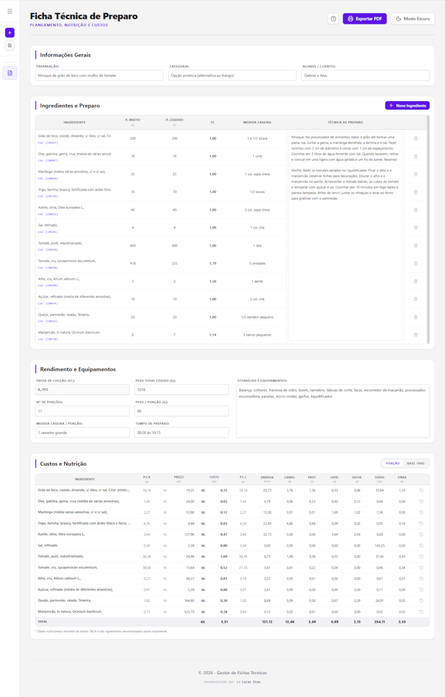
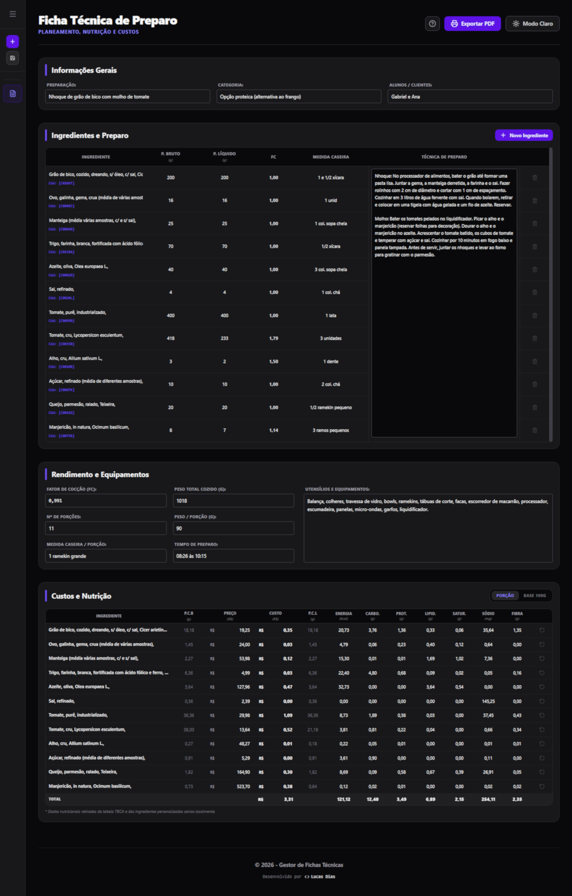
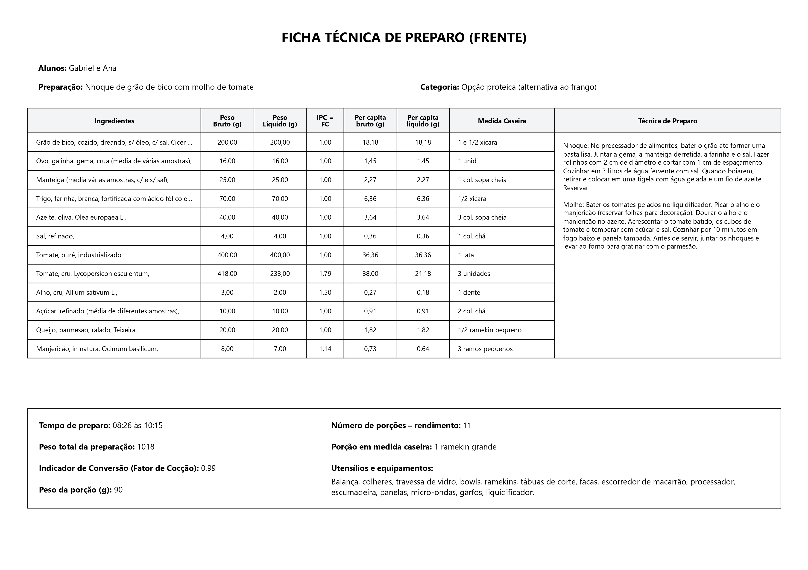

# 🍳 Gestão de Fichas Técnicas

> Um aplicativo desktop focado na criação e organização de fichas técnicas. Permite cadastrar ingredientes, calcular custos, acompanhar rendimentos, gerar cálculos nutricionais baseados na tabela TBCA e padronizar receitas de forma simples e eficiente.

[](https://reactjs.org/)
[](https://vitejs.dev/)
[](https://tauri.app/)
[](https://www.typescriptlang.org/)
[](https://tailwindcss.com/)

---

## 📸 Demonstração das Telas

O aplicativo suporta nativamente os temas Claro e Escuro, adaptando-se à preferência do usuário.
_(Clique nas imagens para ampliar)_

<table align="center">
  <tr>
    <td align="center">
      <strong>Tema Claro</strong><br>
      
    </td>
    <td align="center">
      <strong>Tema Escuro</strong><br>
      
    </td>
  </tr>
</table>

<table align="center">
  <tr>
    <td align="center">
      <strong>Modo de Impressão (Frente)</strong><br>
      
    </td>
    <td align="center">
      <strong>Modo de Impressão (Verso)</strong><br>
      
    </td>
  </tr>
</table>

---

## 🚀 Funcionalidades

- **Gestão de Receitas e Custos:** Cadastro integrado de preparo, equipamentos e cálculo automático de rendimento e custo por porção.
- **Cálculo Nutricional Integrado (TBCA):** Base de dados da Tabela Brasileira de Composição de Alimentos inclusa nativamente, com suporte total para a criação de ingredientes customizados.
- **Modo de Impressão:** Geração de versões limpas e formatadas das fichas, prontas para salvar em PDF ou enviar para a impressora.
- **Interface Otimizada:** Navegação fluida com barra lateral retrátil e suporte aos temas Claro e Escuro.
- **Armazenamento Local (Offline):** Banco de dados embutido para salvar suas fichas de forma rápida e segura no próprio computador.

---

## 🛠️ Tecnologias Utilizadas

Este projeto foi construído utilizando as seguintes tecnologias:

- **[React](https://reactjs.org/)** & **[Vite](https://vitejs.dev/)** - Framework Web e Ferramenta de Build
- **[Tauri](https://tauri.app/)** - Core Desktop (Integração com Sistema Operacional via Rust)
- **[Tailwind CSS](https://tailwindcss.com/)** - Estilização Utilitária
- **[SQLite](https://sqlite.org/)** - Banco de Dados Local (via Tauri SQL Plugin)

---

## ⚙️ Como executar o projeto localmente

Siga os passos abaixo para rodar o projeto na sua máquina:

### Pré-requisitos

- [Node.js](https://nodejs.org/en/) instalado.
- [Rust](https://www.rust-lang.org/tools/install) instalado (necessário para o motor do Tauri).

### Passos

1. **Clone o repositório:**

```bash
git clone https://github.com/lucasd788/gestao-fichas-tecnicas.git
```

2. **Acesse a pasta do projeto:**

```bash
cd gestao-fichas-tecnicas
```

3. **Instale as dependências:**

```bash
npm install
```

4. **Inicie o ambiente de desenvolvimento do Tauri:**

```bash
npm run tauri dev
```

O aplicativo será compilado e uma janela nativa se abrirá automaticamente!

---

## 📦 Download

Você pode baixar a versão mais recente e pronta para uso diretamente na página de [Releases](https://github.com/lucasd788/gestao-fichas-tecnicas/releases) deste repositório.

---

## 📄 Licença

Este projeto está licenciado sob a Licença MIT - veja o arquivo [LICENSE](LICENSE) para mais detalhes.
